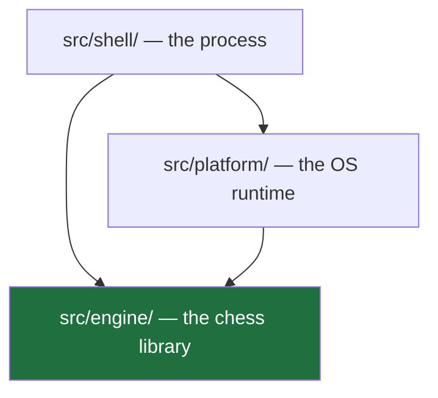
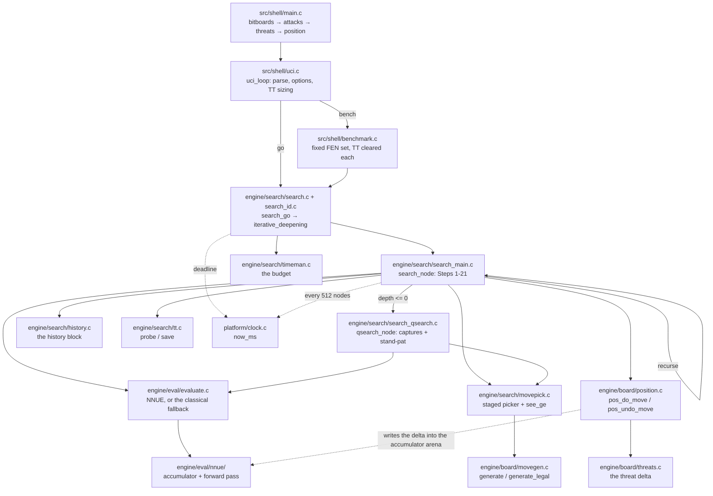

# Architecture

How the code is structured: the three zones, how they depend on each other, how
that dependency is enforced in C, which files are actually in the binary, and how
one search flows through them. For the build and the gate battery see
[09-tooling-ci.md](09-tooling-ci.md); for the C patterns behind the hot path see
[08-idiomatic-c.md](08-idiomatic-c.md). Per-file detail lives in each header's
leading comment block.

This page states structure, not numbers. Where a figure would date the page, name
the command that computes it.

**The zone layout is the engine's shape.** Each zone is decomposed into small
single-responsibility modules. The authoritative list of what is compiled is
`build.sh`'s `SOURCES` array; a file outside it is in the tree but not the binary.

## The three zones

`src/` splits by responsibility, one directory each:

| Zone | Path | Owns | Allowed to include |
| --- | --- | --- | --- |
| **engine** | `src/engine/` | the chess library: types, bitboards, position, movegen, search, per-worker state, TT, evaluation | nothing outside `engine/` |
| **platform** | `src/platform/` | the OS runtime: the clock, memory, threads, NUMA, the Syzygy prober | `engine/` |
| **shell** | `src/shell/` | the process: `main`, the UCI loop, the option table, bench | `engine/`, `platform/` |

The intended stack is `shell -> platform -> engine`, engine at the bottom.
`platform/` is not a layer *beneath* the engine: it is the runtime that hosts the
engine, so it is allowed to depend on engine types, not the other way round.

**Inside `engine/` there is no further layering rule**, and one edge relies on that:
`board/position.c` includes `search/tt.h` and `search/history.h` so the make can
issue the child's transposition and history prefetches from the point its keys become
final, which is where upstream issues them (`position.cpp:1006-1010`). Upstream's
`position.cpp` includes `tt.h` and `history.h` for exactly the same reason. Hoisting
those prefetches out to the caller — which is what the port did before — costs the
lead time the rest of the make would have given them, and no counter here can see it:
callgrind does not model prefetch at all, and a prefetch retires as one instruction.


```mermaid
flowchart TD
    shell["src/shell/ — the process"]
    platform["src/platform/ — the OS runtime"]
    engine["src/engine/ — the chess library"]

    shell --> engine
    shell --> platform
    platform --> engine
    style engine fill:#1f6f3f,color:#fff
```

**There is no edge.** `src/engine/` links with no platform object at all — it is
the standalone chess library its header comments claim, and every host service it
needs arrives through an injection seam.

That is **checked, not asserted**. `zone-check` is structurally blind to this
direction, because the array it links contains all of `platform/`, so a sentence
here could drift with nothing to contradict it.
`./build.sh engine-standalone` compiles every `src/engine/*.c` alone, links them
with nothing else, and fails on any undefined symbol —
[`../tools/engine_platform.baseline`](../tools/engine_platform.baseline) is empty,
so the next host dependency added to `engine/` fails the gate rather than joining
a list.

**Five seams carry it**, each the same shape: the engine declares a function
pointer, the host registers an implementation before the first search.

| seam | registered by | supplies |
| --- | --- | --- |
| [`output_sink.h`](../src/engine/search/output_sink.h) | `search_set_output` | the `info` / `bestmove` line sink |
| [`option_source.h`](../src/engine/search/option_source.h) | `search_set_option_source` | the live UCI option table |
| [`time_source.h`](../src/engine/search/time_source.h) | `search_set_time_source` | the monotonic clock |
| [`arena_source.h`](../src/engine/state/arena_source.h) | `search_set_arena_source` | the page allocator behind the TT, the history banks and each worker |
| [`worker_set.h`](../src/engine/search/worker_set.h) | `worker_pool_install` | the Lazy-SMP worker set on real OS threads |

**Three things have to hold together or a seam leaves its symbol in the link line**,
and the middle one is the one that gets missed:

- the engine zone declares the pointer;
- **every** reader in the zone goes through it. `timeman.c` reads `TimeNowMs`, not
  `now_ms`. One direct call anywhere in `engine/` keeps the dependency whole,
  however complete the seam looks;
- the **host** registers the implementation. `engine_init` does all five, and the
  arena pair goes in FIRST — a block taken from the engine's fallback allocator and
  released by the host's is heap corruption with no diagnostic.

Each seam's default is a working implementation rather than a stub, which is what
lets `engine/` search on its own: the test binary links no platform object and runs
the one-worker set in
[`worker_set.c`](../src/engine/search/worker_set.c) over a malloc-backed arena.
What it cannot do is spawn a second thread, and `resize` says so by refusing a
count above one instead of quietly searching with fewer workers than asked for.

## What is actually in the binary

**There is no dependency scanner and no wildcard.** Two arrays in
[`../build.sh`](../build.sh) enumerate every translation unit:

- `SOURCES` — what the release and debug binaries are built from.
- `ENGINE_SOURCES` — `engine/` plus all of `platform/` (the clock, memory, the
  thread runtime and pool, NUMA, `tablebase.c` and `syzygy/`), what `zone-check`
  links standalone and what [`../tests/test_main.c`](../tests/test_main.c) is built
  against.

A `.c` file that is in neither array is compiled by nothing. It is not in the
binary, not linked by `zone-check`, not reached by `./build.sh test`, and not
covered by `signature`, `perft` or `golden`. **Read the arrays, not the
directory listing, to know what the engine is.**

No `.c` file in the tree is in that state today: every one under `src/` appears in
`SOURCES`. Re-check that rather than assume it; the check is one command:

```sh
comm -23 <(find src -name '*.c' | sort) <(grep -oE 'src/[a-z_/]+\.c' build.sh | sort -u)
```

Empty output means the arrays cover the tree. The zone pages name the specific
modules — see
[01-engine-board.md](01-engine-board.md),
[02-engine-search.md](02-engine-search.md),
[03-engine-eval.md](03-engine-eval.md), [06-platform.md](06-platform.md) and
[07-shell.md](07-shell.md). The shape of the gap is always the same: a module was
ported and checked in isolation, and until it enters `SOURCES` nothing re-checks
it, so it rots silently against the files that do move.

Adding a file therefore means editing `SOURCES`, and — if it belongs to
`engine/` or `platform/` — `ENGINE_SOURCES` as well, or `zone-check` and the test
binary will not see it.

## How the zone rule is enforced

C has no module system, so there is no import graph to lint and no compiler error
for a stray include. The enforcement here is **link-time**, and it lives in
[`../build.sh`](../build.sh):

```bash
./build.sh zone-check
```

`do_zone_check` compiles the `ENGINE_SOURCES` list together with a generated stub
`main` and links the result. No `src/shell/` object is on the command line. If an
engine file has grown a call into `uci.c` or `benchmark.c`, the link fails with an
undefined symbol.

Three properties of this check matter:

- **It links, it does not merely compile.** Compiling would only prove the
  declarations are visible; linking is what proves no call is left dangling. A
  forbidden call to a shell function compiles fine against any prototype and fails
  only at link time.
- **It cannot see the engine→platform edge.** Every `platform/` file is *inside*
  `ENGINE_SOURCES`, so an engine file's include of a platform header resolves and
  the check passes. `zone-check` proves exactly one thing: engine plus platform
  links without shell. It says nothing about the boundary between engine and
  platform — `engine-standalone` is the gate for that.
- **It cannot see a file that is not in the array.** An unwired engine module
  could call straight into `shell/` and `zone-check` would stay green, because it
  never compiles that file at all.

[`../tests/test_main.c`](../tests/test_main.c) is built from the same
`ENGINE_SOURCES` list, so `./build.sh test` is a second, independent instance of the
same check with the same blind spots: a test that needs a shell symbol does not
link.

## The composition root

[`src/shell/main.c`](../src/shell/main.c) is the composition root. It is the only
file that may include across every zone, and nothing includes it.

```c
int main(int argc, char **argv) {
    bitboards_init();
    attacks_init();
    threats_init();  // build RayPassBB, which reads the attack tables
    position_init();
    eval_nnue_init();

    uci_loop(argc, argv);
    search_shutdown();
    eval_nnue_shutdown();
    return 0;
}
```

**The order is load-bearing, and its failure mode is silent.**

1. `bitboards_init()` fills `SquareBB` in
   [`src/engine/board/bitboard.c`](../src/engine/board/bitboard.c). That header is
   the std-only leaf; it holds no attack tables.
2. `attacks_init()` builds the slider lookup in
   [`src/engine/board/attacks.c`](../src/engine/board/attacks.c) and derives
   `PseudoAttacks`, `PawnAttacksBB`, `BetweenBB` and `LineBB` from it. **Which
   lookup depends on the ISA**: at avx2 and above it fills the 64 `DualMagic`
   structs and the rank-attack table for hyperbola quintessence, below that it runs
   the magic search. Both are always initialised in this step; see
   [01-engine-board.md](01-engine-board.md).
3. `threats_init()` builds `RayPassBB` in
   [`src/engine/board/threats.c`](../src/engine/board/threats.c), which reads the
   attack tables step 2 just filled.
4. `position_init()` fills the Zobrist tables in
   [`src/engine/board/position.c`](../src/engine/board/position.c) from a
   fixed-seed generator.
5. `eval_nnue_init()` builds the NNUE feature index tables and allocates the two
   accumulator arenas. Those tables are **zero, not garbage**, beforehand, so a
   missing call is a silent all-zero feature set rather than a crash — the same
   failure shape as step 2, one zone over. The net itself is *not* loaded here: it
   is a runtime input the UCI layer loads, because the UCI layer owns the
   `EvalFile` option. See [03-engine-eval.md](03-engine-eval.md).
6. Only then may any `Position` exist. `pos_set` calls `set_check_info`, which
   reads `PseudoAttacks` and `BetweenBB`.

`main` pairs the init with `search_shutdown()` and `eval_nnue_shutdown()` after
`uci_loop` returns.

A `Position` built before step 2 does not crash. It reads zeroed attack sets, so
`slider_blockers` finds no snipers, `set_check_info` finds no checkers, and
`generate` emits no piece moves. The engine comes up, answers `uci`, accepts
`position`, and searches a board on which nothing attacks anything — a failure that
presents as a search bug, not a startup bug. That is why the order is stated in
`main.c`'s header comment and repeated here: the check that catches it is a human
reading the call sequence.

**`repetition_init` runs inside `position_init`, not beside it.**
[`src/engine/board/repetition.c`](../src/engine/board/repetition.c) builds the
cuckoo table of reversible one-piece move keys, which `pos_upcoming_repetition`
probes at the top of every non-root node. The table is a pure function of the
Zobrist psq and side keys, so it is built where those keys are drawn and takes them
as arguments rather than re-deriving them — a second independently seeded PRNG copy
is exactly the drift it cannot survive. Leaving it uninitialised does not fail
anything: an all-zero table turns a cycle-detection cutoff into a silent no-op,
which costs nodes and moves the signature without raising an error.

The same init sequence opens [`../tests/test_main.c`](../tests/test_main.c)'s
`main`, in the same order, for the same reason.

## The output seam

The engine zone never calls `printf`. `search_go` and `perft` emit their `info` and
perft-divide lines through a function pointer installed by the shell:

```c
// src/engine/search/search.h — the leaf declares the seam.
void search_set_output(void (*emit)(const char *line));

// src/shell/uci.c — the composition root injects the real sink at startup.
search_set_output(emit_stdout);
```

`Emit` starts as `nullptr` and `emit_line` checks it, so an unregistered sink is
silence, not a crash. That is the correct default for a library — but note the
consequence: a gate that forgets to install a sink sees a search that runs and
prints nothing, which looks like a hung engine rather than a wiring bug.

This seam is why `engine/` links without `shell/`, and why a future in-process gate
can capture search output without spawning a subprocess. The clock now has the same
treatment — `time_source.h` and `search_set_time_source`, installed from
`engine_init` — so output and time are injected the same way. The services that
still are not are the arena allocator, the thread pool and NUMA; the dashed edge
above counts them.

## How a search flows


```mermaid
flowchart TD
    M["src/shell/main.c<br/>bitboards → attacks → threats → position"]
    U["src/shell/uci.c<br/>uci_loop: parse, options, TT sizing"]
    B["src/shell/benchmark.c<br/>fixed FEN set, TT cleared each"]
    SG["engine/search/search.c + search_id.c<br/>search_go → iterative_deepening"]
    AB["engine/search/search_main.c<br/>search_node: Steps 1-21"]
    QS["engine/search/search_qsearch.c<br/>qsearch_node: captures + stand-pat"]
    MP["engine/search/movepick.c<br/>staged picker + see_ge"]
    HI["engine/search/history.c<br/>the history block"]
    TM["engine/search/timeman.c<br/>the budget"]
    MG["engine/board/movegen.c<br/>generate / generate_legal"]
    PO["engine/board/position.c<br/>pos_do_move / pos_undo_move"]
    TH["engine/board/threats.c<br/>the threat delta"]
    TT["engine/search/tt.c<br/>probe / save"]
    EV["engine/eval/evaluate.c<br/>NNUE, or the classical fallback"]
    NN["engine/eval/nnue/<br/>accumulator + forward pass"]
    CL["platform/clock.c<br/>now_ms"]

    M --> U
    U -->|"go"| SG
    U -->|"bench"| B --> SG
    SG --> TM
    SG --> AB
    AB -->|"depth <= 0"| QS
    AB -->|"recurse"| AB
    AB --> MP
    AB --> HI
    AB --> PO --> TH
    AB --> TT
    AB --> EV
    QS --> EV
    QS --> MP
    MP --> MG
    EV --> NN
    PO -.->|"writes the delta into the accumulator arena"| NN
    SG -.->|"deadline"| CL
    AB -.->|"every 512 nodes"| CL
```

`uci_loop` parses a `go` line into a `SearchLimits` and calls `search_go`.
`search_go` resolves the time budget once through `timeman_init`, seeds a legal
move, then deepens: each iteration runs `alphabeta` from the root, reads the best
move back out of the TT, and emits one `info` line through the sink. `alphabeta`
recurses, dropping into `qsearch` at depth zero; both pull moves from the staged
`MovePicker`, apply them with `pos_do_move`/`pos_undo_move`, and score leaves with
`evaluate`.

Each real make/unmake in that recursion is bracketed by `eval_acc_push` /
`eval_acc_pop`, so `pos_do_move` writes its NNUE delta straight into the
accumulator's own arena rather than into a copy. That bracket is a contract, not an
optimisation: skip it and the accumulator silently describes a different position
than the board does. The null move and `perft` are the two deliberate exceptions —
see [03-engine-eval.md](03-engine-eval.md) for why an empty push is not the same as
no push.

The only wall-clock read inside the recursion is the one guarded by the
node-count checkpoint in `check_time` — see
[02-engine-search.md](02-engine-search.md) for why that guard is what keeps the
signature gate meaningful.

Nothing on that path allocates. The move lists are `ExtMove list[MAX_MOVES]`
automatics and the `StateInfo` per ply is an automatic in the recursing frame; the
engine's three heap blocks — the transposition table, the NNUE accumulator stack and
the refresh cache — are all allocated once, outside any search.

## What is on disk but not in the binary

Nothing. The `SOURCES` array is the sole authority on what is compiled, and it
enumerates every `.c` file in the tree — run the `comm` check above to re-establish
that rather than trusting this paragraph.

The shell is the zone where that is easiest to doubt, because two of its files look
like alternatives to each other and are not: `engine.c` owns the session — the
position and its `StateList` chain, the option table and its on-change callbacks,
the resident net, the search wiring — and `uci.c` is the transport over it, holding
no engine state. Both are in `SOURCES`. [07-shell.md](07-shell.md) describes the
split.

The zone diagram above is the shape all of that lands into.
