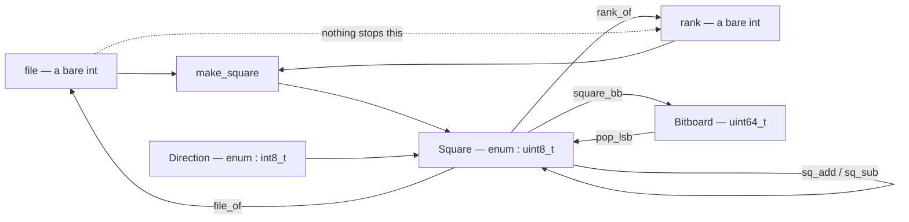
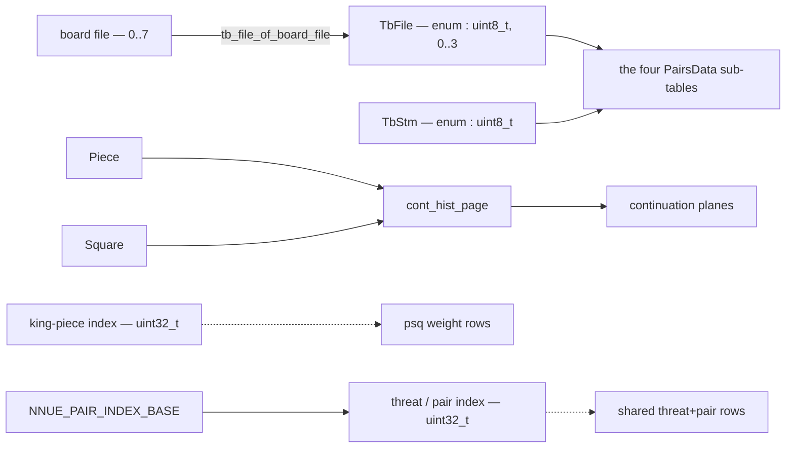
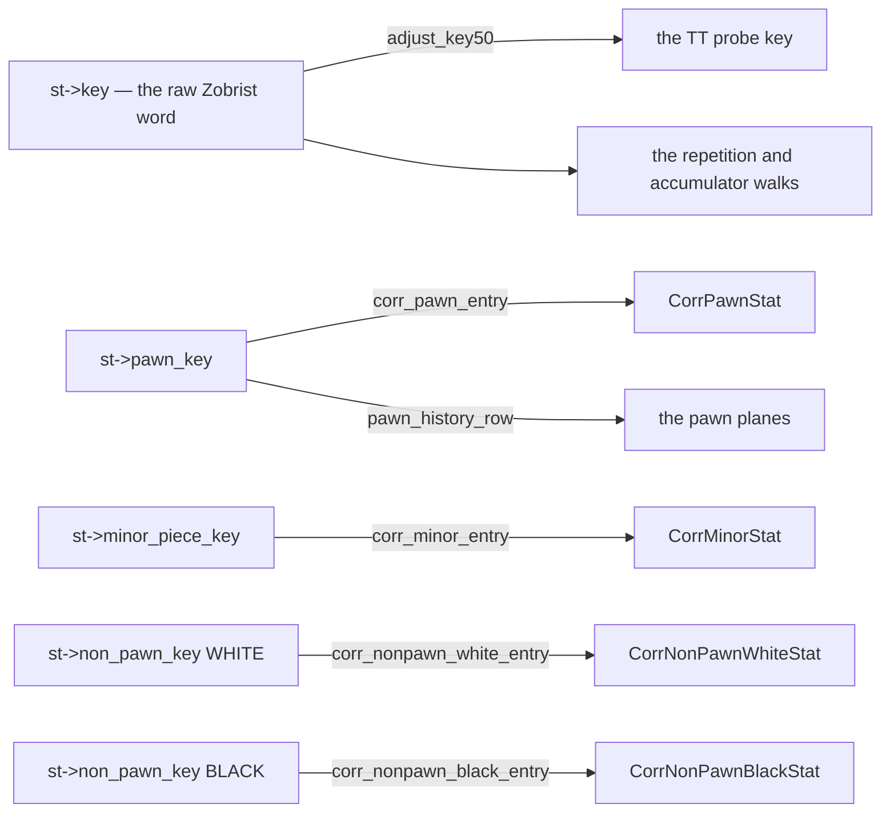
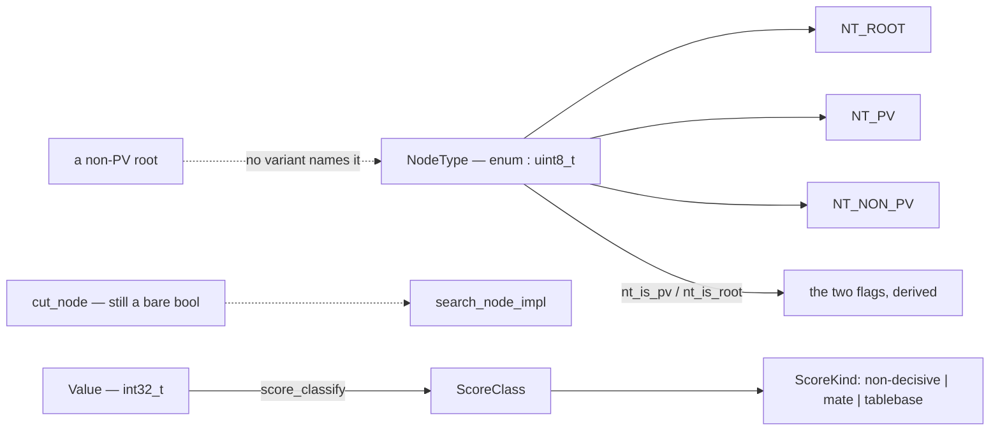
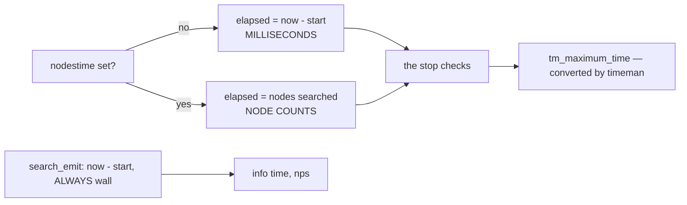

# The value domain

What mcfish's quantities *mean*, which of them the compiler can tell apart, and —
stated as plainly as the rest — which of them it cannot.

[08-idiomatic-c.md](08-idiomatic-c.md) is the neighbouring page: it records how a
C++ construct becomes a C23 one and what each translation measured. This one
records what the resulting values denote. The theory each family rests on is
collected in [11-references.md](11-references.md) under "Type theory and type
design", with what each citation is for.

Audience: engine and platform contributors.

## The premise, and why it reads differently here than elsewhere

The usual argument for a domain type is that it removes a runtime check. **That
argument does not apply to mcfish at all.** The release binary is `-O3` C with no
bounds checking anywhere; there is no check for a type to fold away and no
`unsafe` boundary for it to guard.

So a type here buys exactly one thing, and it is worth more than the check would
have been:

> **A swap between two same-typed quantities does not fault. It answers wrong.**

That is this port's characteristic failure. The engine keeps running, the
evaluation or the tablebase verdict is a plausible number, and every value gate in
this tree compares output *this binary produced* — so on a mispairing they agree
unanimously and are wrong together. The only gate that notices is the bench
signature, and it says *that* something moved, never *where*.

A type removes the shape rather than the instance. That is the whole case.

## The two instruments C23 gives, and they are not equally strong

This is the fact a contributor needs before proposing any type here, and it is
where mcfish differs most from its sibling ports.

| instrument | what it is | strength | arithmetic |
|---|---|---|---|
| `typedef enum : uint8_t` | a distinct type with a fixed underlying width | clang **warning**, promoted to error by `build.sh` | promotes to `int` freely |
| `typedef struct { T v; }` | a genuinely incompatible type | **hard error**, no flag involved | none at all without `.v` |

The enum tier is the port's workhorse: `Square`, `Piece`, `PieceType`, `Color`,
`Direction`, `MoveType`, `CastlingRights`, `NodeType`, `ScoreKind`, `Bound`,
`TbFile` and `TbStm` are all of this shape. Two facts about it are load-bearing:

- **It is a diagnostic, not a language rule.** `-Wimplicit-enum-enum-cast` and
  `-Wimplicit-int-conversion` are what reject a confusion, and both are ordinary
  warnings. The release build is not `-Werror`, so until they were promoted the
  whole enum layer was an advisory nobody was required to read. `build.sh` now
  promotes exactly those two, probing for them because gcc rejects the option
  spellings outright — under the second-compiler lane the enum tier stays
  advisory, and that limit is real rather than theoretical.
- **Neither promotion stops an explicit cast**, which is deliberate. A narrowing
  conversion is sometimes correct; it should be a line a reviewer can see.

The struct tier is used where the enum tier cannot reach — see
[the correction counters](#hashes-four-key-spaces-and-the-counters-they-select).
It costs nothing in layout, and where it is used the layout is pinned by
`static_assert` rather than assumed.

**C's third option is absent.** WG14's strong-typedef proposal (`_Newtype`, the
`[[strong]]` attribute) would give a distinct type that still participates in
arithmetic, which is exactly what a score or a key would need. It is a proposal
for a future revision, implemented by no compiler this port builds with, and
[11-references.md](11-references.md) carries it as a thing to watch rather than a
thing to use.

## The maps

Five, because the families answer different questions and one diagram hides all
five. A **solid** arrow is a named function — a value crosses a boundary by
calling something, and the call is where a reader looks. A **dashed** arrow is a
crossing the compiler still permits.

### Board geometry: typed at the ends, untyped in the middle

**The dashed arrow is the honest part of this diagram.** `Square` and `Direction`
are distinct types and a confusion between them is now a hard error — that is
`sq_add`'s whole reason for re-tagging once instead of at every call site. But
`file_of` and `rank_of` both return a bare `int`, and `make_square(int f, int r)`
takes two of them, so `make_square(rank_of(s), file_of(s))` compiles silently and
produces a real square of the wrong one.

That is deliberate and it is not comfortable. `File` and `Rank` are the most
diff-sensitive quantities in the port — they are read directly against upstream's
own spellings — and they are live inside the search body, which is the shape [the
cost rule](#the-cost-rule) says a wrapper perturbs. It is recorded in
[the boundary](#what-a-compile-error-does-not-stop) as the normal case rather than
an oversight.

`SQ_NONE = 64` stays an in-band sentinel rather than becoming a separate optional
type, and `types.h` static-asserts it against NNUE's own no-square constant,
because `DirtyPiece` stores raw `uint8_t` squares and tests them against 64.

### Index spaces: one route per table

`TbFile` is the index space where a wrong answer is worst: a Syzygy verdict is
reported as fact, not as an estimate. A board file is one of eight and a table
file one of four, `tb_file_of_board_file` is the only route between the spaces,
and `TbStm` exists so that `tbtable_get`'s last two arguments are no longer the
same type — transposed, they used to stay in range through `stm % t->sides` and
read a real sub-table of the wrong side.

The two NNUE feature index spaces are dashed because they are still `uint32_t`.
They are *concatenated* into one weight array, so the pair block begins exactly
where the threat block ends — a property `NNUE_PAIR_INDEX_BASE` derives from
`NNUE_THREAT_DIMENSIONS` rather than restating. That closes the drift; it does not
close the confusion, and [the boundary](#what-a-compile-error-does-not-stop) says
why the type is blocked.

### Hashes: four key spaces, and the counters they select

Every key here is a `Key`, which is a `uint64_t`, and that is not going to change
— see [why there is no Key type](#why-there-is-no-key-type-and-no-value-type).
What is typed instead is the **pairing**.

`adjust_key50` is the only route from the raw word to the TT key, and it mixes the
halfmove clock only at and above a threshold. Below it the two keys are
*identical*, which is why a confusion between them can pass every bench position
and still be wrong.

The four correction counters are the sharper case. They live in one
`CorrectionBundle`, are selected by four *different* Zobrist keys, and were read
through a field picked **after** the row lookup — so `corr_bundle(h,
st->pawn_key, us)->minor` compiled and returned a real counter of the wrong kind.
Two changes close it, and the second is what makes it a compile error:

- Four accessors, each reading its own key out of the `StateInfo` **and** its own
  field. Neither half is a parameter, so a call site holds nothing to transpose.
- Each field has its **own struct type**. In Zig or Rust the row lookup could be
  made private and the accessors would be enough; C has no module privacy inside a
  header, so `corr_row` stays visible and only incompatible field types stop the
  old shape. `CorrPawnStat` and its three siblings are one-member structs, and six
  `static_assert`s pin `sizeof`, `alignof` and all four offsets because
  `history_clear` zeroes the whole array through a single `int16_t *`.

### Node kinds and the score boundary

A node's kind is one tag, not two independent booleans. Four combinations for
three meanings means a non-PV root is expressible and names nothing — no call site
produces one — so `NodeType` makes it unwriteable, and the bodies derive
`pv_node` and `root_node` from the tag so the two cannot drift apart. Because the
tag is a compile-time argument to an `always_inline` body, this costs nothing:
every test on it folds in each clone, which is the same thing upstream's template
specialisation does.

The score stays `int32_t` throughout the search. What is typed is the **boundary**:
`score_classify` turns a raw value into a `ScoreClass` whose `ScoreKind` is a
three-variant enum, so the UCI reporter switches exhaustively on *mate /
tablebase / ordinary* rather than on magic magnitudes with an `else`. A decisive
score is a fact rather than an estimate, and three variants make that visible
where it is reported.

The dashed `cut_node` arrow is the honest part again: it is still a bare `bool`
passed positionally. That is a *provenance* problem rather than an illegal-state
one — both of its values are real — and it is left alone deliberately; see
[the boundary](#what-a-compile-error-does-not-stop).

### The clock: two quantities, one TimePoint, and a flag that decides which

`nodestime` converts the whole clock model into node counts, so `optimum_time` and
`maximum_time` change *physical unit* under `use_nodes_time`, a `bool` stored
beside them. All of them are `TimePoint` and nothing in the type system relates
them.

The crossings that matter are right, and they are right **structurally rather than
by type**: `timeman` converts the maximum into the budget's own unit, so the stop
check compares like with like, and reporting has its own producer — `search_emit`
computes `info time` and nps from the wall clock unconditionally, so a GUI is
never told a search took N milliseconds when the engine was counting nodes.

**Why this is documented rather than typed** is the honest half. Making the bounds
unreachable without their unit means putting them behind accessors, and they live
in flat structs the search driver threads through. That restructuring is a larger
change than the defect justifies, and naming the flag alone would be a rename
dressed as a guarantee — see [Adding a type](#adding-a-type), step 3.

## Denotation: a type is a set of values

The frame is the ordinary denotational one — `TbFile` denotes the four sub-tables,
`ScoreKind` the three outcomes a score can name, `Square` the 64 squares.
Membership is construction, so a value of the type *is* a proof that it belongs to
the set, which is why the constructors matter more than the methods.

Two rules govern them here:

- **One named route between two spaces.** `tb_file_of_board_file` is the only
  conversion from board files to table files; `adjust_key50` the only one from a
  raw key to a TT key; `NNUE_PAIR_INDEX_BASE` the only thing that lifts a pair
  index into the shared array. When there is exactly one, it is the line a
  reviewer reads.
- **Never mask.** A mask under a name that reads lossless turns a corrupt byte
  from a Syzygy file or a transposition entry into a plausible piece — a wrong
  answer where a detected fault was available. Where the input is untrusted, the
  parse is bounded and refuses instead ([05-tablebases.md](05-tablebases.md)).

## Why there is no `Key` type and no `Value` type

Deliberate, and worth writing down because these are the two types a reader will
propose first.

**A score.** `Value` is `int32_t` and is *computed with* on every node — added to
margins, compared against beta, scaled, negated. C has no operator overloading, so
a struct wrapper would turn every one of those expressions into a function call,
in the code that is read most directly against upstream's own arithmetic. The
enum tier cannot help either: an enum promotes to `int` in exactly the arithmetic
the type would exist to police. A sibling port that *does* have operator
overloading measured its score newtype at **+0.158%** at its lower tier anyway,
with no attributable symbol — register pressure in the node body. Refuted twice
over.

**A Zobrist key.** The same shape and worse: a key is XORed on every `do_move`,
several are live at once in that function, and `StateInfo` is copied per move.
Welding the *accessor* closes the defect that mattered and touches no arithmetic,
which is what this port did.

**A depth.** Upstream spells it `using Depth = int` for a reason that transfers
exactly. A depth-scaled product feeds at least six different codomains — a history
bonus, two score margins, a move count, a history magnitude, and a reduction
denominator. A type carries its unit through arithmetic only if the operation has
one result type; any single choice leaves the other five needing an escape, and the
choice that serves all six turns any depth into any integer. **A type that needs
six output types needs none.**

Units-of-measure systems solve this with unit polymorphism, where a function is
generic in the unit it returns ([11-references.md](11-references.md)). C cannot
express that, so the honest answer is to leave these scalars and say why.

## The cost rule

Measured across a sibling port's twenty-five type-shaped changes at two ISA tiers,
and it contradicts the usual claim that a newtype is free:

> A newtype over a scalar is free while the value is **carried** — produced,
> stored, passed, indexed with. It can cost when many instances are **live at once
> inside one large function**, because that is a register-allocation problem and
> the wrapper perturbs it. The cost appears as extra `mov`, has no attributable
> symbol, and no attribute addresses it.

Free: index spaces carried in an array and consumed one at a time, coordinates
passed to a table lookup, every layout-preserving rename. Costly: a scalar threaded
through the control flow of a function large enough to dominate the profile.

**The rule is about what a function HOLDS, not what it is parameterised by.** A
compile-time argument to an `always_inline` body occupies no register, so
`NodeType` is free even on the hottest function in the engine — every clone folds
the tag exactly as two booleans did. Replacing a *runtime* boolean with a
two-variant enum is a different change and is what the rule actually governs;
that is why `cut_node` here is still a `bool`.

**Diagnose it with the static instruction mix of the enclosing function, not a
callgrind symbol diff.** A symbol diff reports "diffuse" and stops; the opcode
histogram of the one function names the mechanism.

**The rule is predictive, not exact.** It has already mispredicted elsewhere — a
typed ply pushed into an NNUE transform was predicted free by it and cost nearly a
percent. So a type on a hot path is an experiment, measured whatever the
prediction says, and a sibling's measurement is a hypothesis about *this* compiler
rather than a result ([08-idiomatic-c.md](08-idiomatic-c.md)).

## What a compile error stops

Each has been made to fail on purpose, and the errors counted.

- One domain enum reaching another's parameter — a `Direction` where a `Square`
  belongs, and the reverse.
- A raw narrowing integer entering a domain type without a visible cast: a board
  file assigned straight to a `TbFile`.
- The Syzygy side-to-move and the table file, transposed at the DTZ read.
- A correction counter read through a field the row's key did not select.
- A `Bitboard` where a `Key` belongs is *not* on this list, and that is the point
  of the next section.
- A non-exhaustive switch over `ScoreKind`, under `-Wswitch`.
- A non-PV root, which has no variant to name it.
- A widened domain type: `types.h` closes with `static_assert`s tying each width
  to the *relationship* that implies it — `SQ_NONE == 64` against NNUE's own
  sentinel — so the assertion cannot go stale.

## What a compile error does NOT stop

A page that omits its own boundary invites over-trust, and this one is short
enough to invite it.

**Two arguments of the same type, transposed.** The single largest hole, and it is
structural rather than an oversight. `make_square(f, r)` takes two `int`s;
`make_move(from, to)` takes two `Square`s; the four correction accessors share a
signature. A newtype stops a `Direction` reaching a `Square` parameter and does
nothing about two arguments that are genuinely two of the same thing. Where it
mattered most the fix was not another type — it was moving both halves *into* the
accessor so no call site carries one to transpose — and that technique does not
generalise to `from` / `to`.

**A wrong index that is in range.** Every index type here is a distinct type over
an integer, not a refinement over a range. `TbFile` narrows *which space* an index
lives in, never *which entry*. The Syzygy prober is the sharpest case: an index
computed one off there still returns a confident wrong verdict.

**File and rank.** Both are bare `int`, so `make_square(rank_of(s), file_of(s))`
compiles and `relative_rank(c, s)` takes an untyped pair. This is the largest
untyped surface in the tree, it is deliberate — diff fidelity against upstream's
spellings plus the cost rule — and the first map's dashed arrow is therefore the
normal case rather than an exception.

**Every `typedef` over an integer that is not an enum.** `Key`, `Value`,
`Bitboard`, `Move` and `TimePoint` are aliases, not types. A `Key` where a
`Bitboard` belongs compiles silently, and so does a `Value` where a `Move` does.
Only the `enum` and `struct` tiers are types; a plain `typedef` is documentation.

**The NNUE feature index spaces.** Still `uint32_t`, and blocked rather than
overlooked. The producers are vectorized writers that store whole vectors of
`uint32_t` into these buffers; typing only the consumer would reintroduce an
unchecked cast at exactly the boundary the type exists to guard. Typing at the
boundary or not at all is the rule, and this is the case that earned it.

**A physical unit.** `optimum_time`, `maximum_time` and the elapsed figure are all
`TimePoint`, and the first two change unit under `nodestime`. Nothing rejects a
comparison between two of them in different units. What holds here is a separate
*producer* for the wall clock, not a separate type.

**Boolean provenance at a call site.** `cut_node` is a bare `bool` passed
positionally, and `cont_hist_page(h, in_check, capture, pc, to)` takes two
adjacent booleans — either pair transposable, and a transposition still selects a
real plane of the continuation table. Both values are legal in every combination,
so this is provenance rather than an illegal state, and it sits on a per-node path
where the cost rule predicts a real if small cost. Recorded as known, not fixed.

**Anything under gcc.** Both promotions are clang spellings that gcc rejects
outright, so the second-compiler lane builds with the enum tier as warnings only.
The struct tier is the only one that holds in both.

**The bug classes that have cost this port the most**, none of which is a typing
problem: integer semantics under conversion, two generators emitting the same set
in a different *order*, a key identity that omits the halfmove clock, and a state
update that "obviously" belongs and does not.
[08-idiomatic-c.md](08-idiomatic-c.md) owns those.

**Cost.** A type is not free here and the direction is not predictable from the
source.

## Adding a type

1. Say which set it denotes, and give it a constructor that is the only way into
   that set.
2. Check the value is **carried**, not computed with. If it participates in
   arithmetic on a hot path, expect a cost and read
   [the cost rule](#the-cost-rule) before starting — and remember C gives you no
   operator overloading, so a struct wrapper turns every arithmetic site into a
   function call.
3. Type at the boundary, or not at all. If the producer cannot be typed, a cast at
   the consumer is a rename, not a guarantee — say so instead of shipping it.
4. Pick the tier honestly. `enum : T` if the value is an index or a tag and you
   want it to stay usable in arithmetic; a one-member `struct` if you need the
   confusion to be a hard error, and then pin the layout with `static_assert`.
5. **Make the mutation fail.** Break the code on purpose in the way the type is
   meant to stop, build it, and record the compile errors. Arguing that it would
   fail is not watching it fail.
6. Gate it: `./build.sh parity` for anything, plus `./build.sh tb-cursed` by hand
   if it touches the prober, since that gate sits outside `parity`. Check the exit
   code, never a piped fragment.
7. Add a row here — to a map, to the boundary, or to both. A type added without
   one makes this page quietly wrong.
